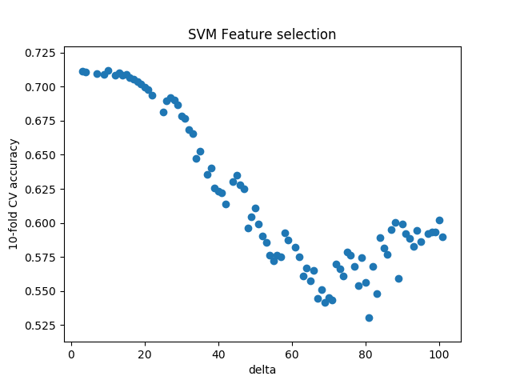
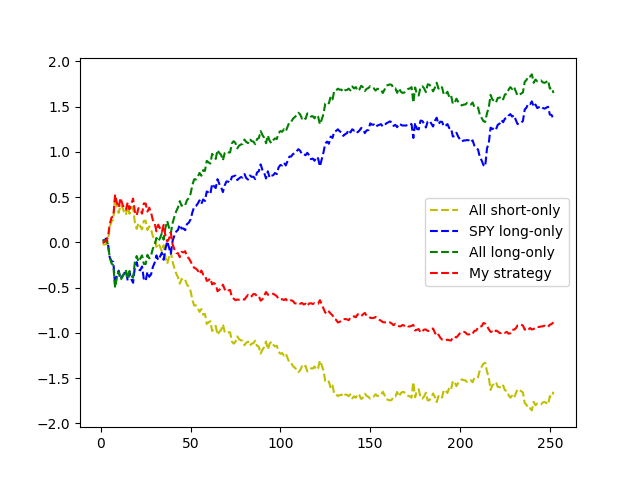
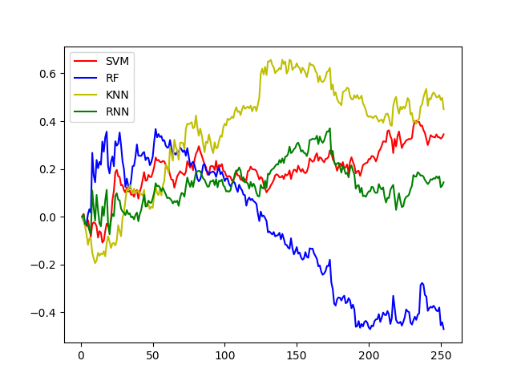

# Introduction
Stock price is generally considered as a random walk process according to Paul Samuelson's theory in 1965 [1]. Despite this fact, machine learning is still giving people a guide.
In this work, I study four machine learning methods (SVM, Rand Forest, kNN, Recurrent NN) to find the best approach to make a good prediction. The input is purely based on historical OHLC and volume of nine ETFs ('XLE', 'XLU', 'XLK', 'XLB', 'XLP', 'XLY', 'XLI', 'XLV', 'SPY'). Though the performance isn't existing in terms of fortune making, the result shows some positive direction toward future study.

# Approach
The problem of predicting next day's price is transformed into: predict `Up` if tomorrow's close is greater than open; predict `Down` if tomorrow's close is smaller than open. Thus, I transform this to be a classification problem: using today's OHLC to predict next day's `Up/Down`.

The buying strategy will follow the prediction result, if `Up`, then `long`, otherwise `short`.

## Feature generation
Raw data contains five columns: Open, High, Low, Close, and Volume. To enrich information,
1. add one extra column: `Return` (= (Close - Open) / Open)
2. by user defined `delta`, append `delta` days' OHLC, volume, returns
3. also append `delta` days' `close price percentage change` and `rolling mean of returns`

## Parameter tuning
We need to find the best of two parameter sets: `delta` and its corresponding parameters for classifier.

This is tuned by a series of cross validation process. Following is the best `delta` found in this study.

|SVM | Rand Forest | kNN | Recurrent NN |
| --- | --- | --- | -- |
| 4 | 3 | 99 | 20 |

For example, the best `delta` for random forest is 3, while for kNN is 99. The best `delta` gives a hint that random forest is a decision tree and will suffer in high dimension problem, while kNN needs more dimension of data to learn.

* RNN is tested only 4, 10, and 20 due to the running time issue.



After the best `delta` is defined, we need to find the best parameters set. This is especially important for SVM. The best parameter set for SVM is `c=8, g=0.0125` with accuracy ~= 71%.

## Cross validation

Cross validation is done with the dataset from 2014/1/1 to 2015/12/31. 10 fold cross validation is used in this study. Because the data is time series, training data is split based on time point instead of random sampling. The cross validation process will be: train on fold 1, test on 2; train on fold 1-2, test on 3; train on fold 1-2-3, test on 4, and so on.

## Implementaion detail of recurrent neural network
The RNN is implemented with Google Tensorflow and Keras library.
It's composed by two layer of LSTM (long short term memory). As previous price would effect future price, I rely on LSTM to learn both long term effect and short term effect. A dropout 0.2 is added after each LSTM in order to prevent overfitting.
Finally a layer of sigmoid function to aggregate the final classification result.

Number of neuron, number of layers, even the dropout rate are worth to fine tuning. However, due to my hardware limitation, I only pick a reasonable number in this work. This may be the reason that my RNN isn't working well.

Following is the snippet of my RNN setup:
```python
    model = Sequential()

    model.add(LSTM(
        128,
        input_shape=(None, X_train.shape[2]),
        return_sequences=True))
    model.add(Dropout(0.2))

    model.add(LSTM(
        100,
        return_sequences=False))
    model.add(Dropout(0.2))

    model.add(Dense(
        units=1))
    model.add(Activation('sigmoid'))

    model.compile(loss='binary_crossentropy', optimizer='adam', metrics=['accuracy'])

    model.fit(
        X_train,
        y_train,
        batch_size=64,
        epochs=64,
        validation_split=0.1)
```

## Other implementation detail
The data is downloaded via `pandas datareader` package.
SVM, rand. forest, and kNN is provided in `sklearn` package.

# Evaluation
Following is my result comparing with the other three baseline strategies.



Sharpe ratio

| SPY long-only | All long-only | My strategy |
|----|----|-----|
|1.55713240229 | 1.93782084967 | 1.01931178478 |

Red lines is my strategy, using SVM as the predictor to predict the next day Up/Down.

## Compare four studied methods

Among four methods I study, following is the gain-and-loss ratio for each of them. Though kNN seems perform best, its Sharpe ratio isn't.



|SVM | Rand Forest | kNN | Recurrent NN |
| --- | --- | --- | -- |
|1.0193117847799729| -0.92876389213784849| 0.99001496191438487| 0.04404309221899539|

## Can we further improve this?
Likely yes. As the SVM strategy provides good result in the first 35 days. To make the tail part raise, two potential strategies can be adopt:
1. Include more recent data
2. Hybrid methods, like using kNN in later part of prediction

I attempted method 1, but don't get significant change in curve. I suspect that I need to re-train all model: including `delta` and `cost and gammar`.

Method 2 is suspicious, because we know kNN performs well only after we try the *out-sample testing*. A reinforcement learning method may adaptive select the best model at each time point to maximize the profit.

# Conclusion and Future work

With limited time, many interesting idea cannot be realized and I hope that I can keep work on this with a full-time position.
Following are my idea of improvement:
1. Include market sentiment in prediction. I googled and found many effort working on using news of social media as extra source to improve the stock price prediction. Actually, price is changed more with crowd's general acknowledgement.
2. Using wavelet as feature. For example, Chandar [2] uses wavelet in neural network to predict stock. As wavelet is a better description of long term history change, I believe this would help.
3. Fine tune RNN. Neural network is complex system. More complex when LSTM provides feedback to previous layers. I believe that RNN should work best, but I didn't find the optimized setting yet.

# Reference
[1]: [Efficient Market Hypothesis: Is The Stock Market Efficient?](http://www.investopedia.com/articles/basics/04/022004.asp/)

[2]: Chandar, S. Kumar, M. Sumathi, and S. N. Sivanandam. "Prediction of stock market price using hybrid of wavelet transform and artificial neural network." Indian Journal of Science and Technology 9.8 (2016).
